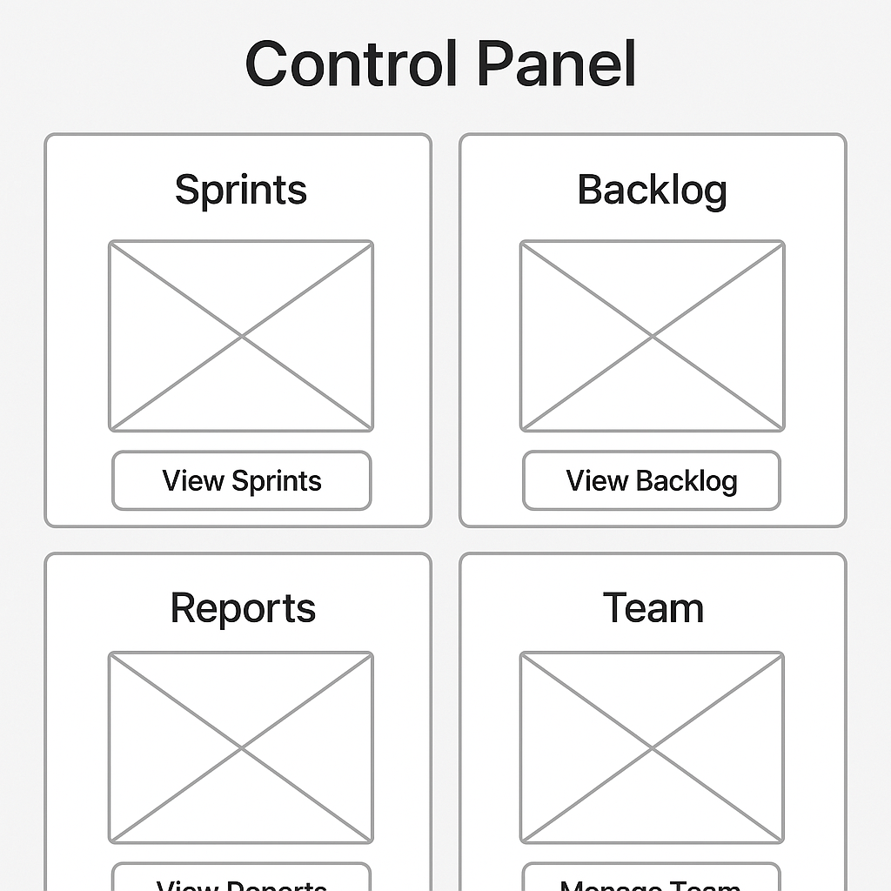
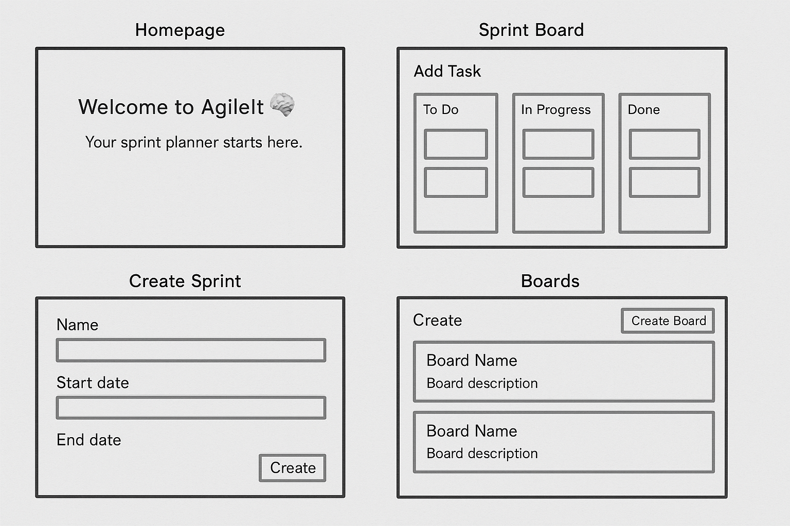
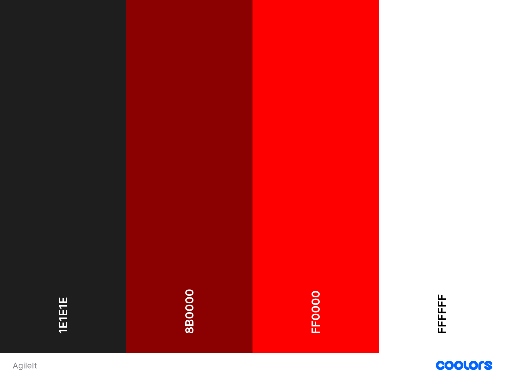
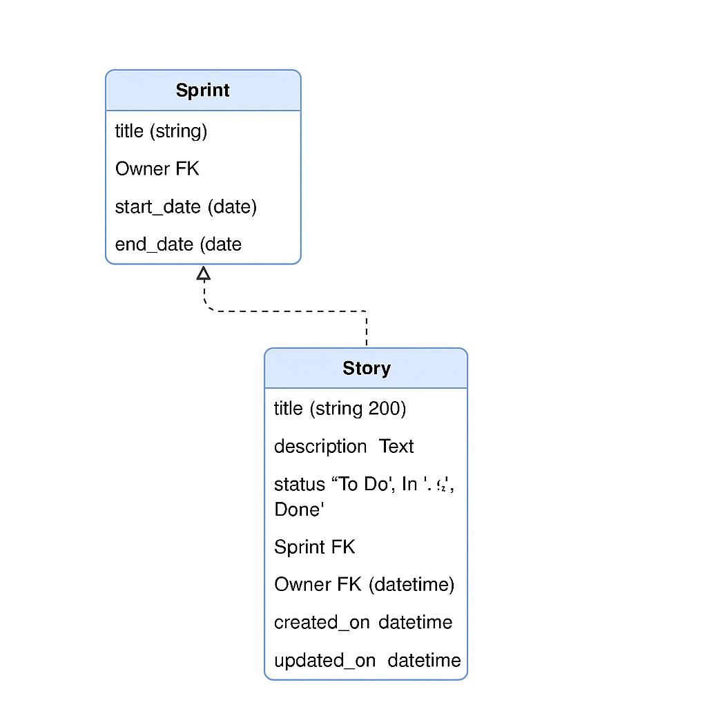
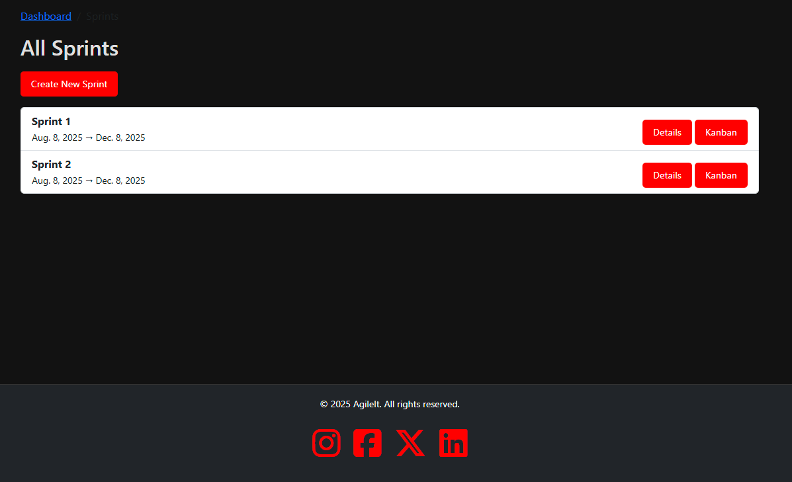
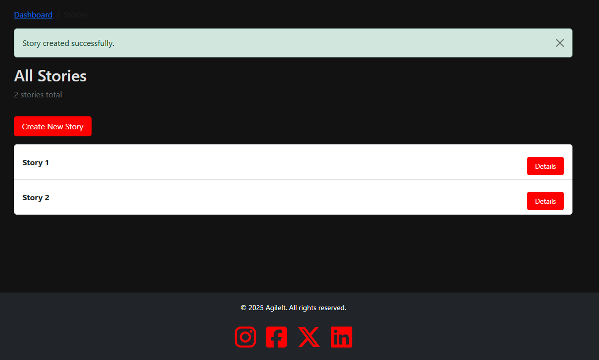

# CapstoneAgileIt

AgileIt is a lightweight Agile project tracker built with Django and Bootstrap. It supports Kanban-style task management, user authentication via Django Allauth, and a responsive layout for desktop and mobile use. AgileIt is a lightweight Agile project management tool built with Django. It helps teams manage Stories and Sprints with a focus on clarity, automation, and usability. This MVP delivers the core functionality needed to run Agile workflows efficiently. Once a user has created a sprint they can create stories and move these around a drag and drop kan ban board, or use the drop down menu to "To Do", "In Progress" and "Done". This manages their work flow in accordance to Agile methodology. 

## Repository:

Github repo: [My Project Repository](https://github.com/JoshThould/AgileIt)

Github project board: [My Project Board](https://github.com/users/JoshThould/projects/12/views/1)

Deployed Link: [Deployed Link](https://agileit-cde4464b00d1.herokuapp.com/accounts/login/?next=/dashboard/)

## Wireframes:

## Colour Palette

## ERD

## Features
- Kanban board with column-based story organization
- Create, update, and delete user stories
- User authentication via username (Django Allauth)
- Responsive layout using Bootstrap 5
- Deployed to Heroku

### Control Panel:

### kanBan Board: 

### Sprint list

### Story list

## Future Features
These features are not yet implemented in the MVP but are part of the AgileIt roadmap:
- Reports: Generate sprint analytics, velocity charts, and burndown graphs.
- Team Management: Assign roles, track member contributions, and manage permissions. I included the buttons with a modal in the project to show that they're going to be included in future iterations but due to time considerations and the fact they didn't add core functionality i decided not to include them in this iteration. 
- Epic functionality wasalso prototyped but removed from the final MVP to maintain clarity and focus. 
- Tasks & Acceptance Criteria
These models were prototyped but removed from the final MVP to streamline the user experience. Future versions may reintroduce them as nested components within stories.

## Tech Stack
• 	Django 4.x
• 	Bootstrap 5
• 	Django Allauth
• 	Heroku

## Setup Instructions
Clone the repository

Create and activate a virtual environment

Install dependencies

Apply migrations

Create a superuser (optional)

Run the development server

## Heroku Deployment Notes

- Set environment variables via Heroku config (e.g., `DEBUG`, `SECRET_KEY`, `ALLOWED_HOSTS`)
- Configure Django Allauth settings appropriately
- Run `python manage.py collectstatic` before first deploy
- Confirm your `ALLOWED_HOSTS` includes your Heroku app domain

## Testing: 

### Model Tests
- Sprint and Story models were tested for:
- __str__ output
- get_absolute_url() resolution
- Foreign key integrity
✅ View Tests
- StoryListView and SprintDetailView were tested for:
- 200 OK response for authenticated users
- Redirects for unauthenticated access

### Manual Testing 

- Responsiveness: The website has been tested on mobile, tablet and desktop devices to ensure responsiveness to all screen sizes.
- Browser functionality: I tested this on Chrome, if i had more time i'd download a few of the most popular browsers but unfortunately, due to time constraints it has 
only been tested on Chrome.
- Full manual walkthrough of:
- Signup, login, logout flows
- Sprint creation and story assignment
- Kanban board rendering
- Admin panel access and CRUD operations
- Flash messages and redirects

### Statoc and Template checks

- Verified static file collection via: pyhton manage.py collectstatic

### Validation Testing

All code has been validated through:

HTML: W3C Markup Validator.
CSS: W3C CSS Validator.
Python: PEP8 validation to ensure code quality.

## Known Issues

- Accessibility limitations:
ARIA roles, contrast ratios, and keyboard navigation need improvement. I attempted a fix using the Copilot agent, but it broke the layout and cost valuable time. With more time, I would revisit this with a manual, standards-based approach.
- Mobile layout for Kanban columns:
The Kanban board works well on larger screens, but responsiveness on mobile is limited. A future iteration would focus on improving column stacking and scroll behavior for smaller devices.
- Missing story filtering and search:
Filtering stories by sprint, status, or keyword would significantly improve UX. This was scoped out due to time constraints but remains a high-priority enhancement.
- Owner/User field confusion in early model drafts:
I initially renamed user to owner in the models. This worked locally, but without resetting migrations, it caused ghost fields and Heroku crashes. The app ran fine locally but failed in production.
- Migration drift due to .gitignore:
An early .gitignore excluded the migrations/ folder, which led to schema mismatches between local and Heroku. I couldn’t resolve this in time, so I started a new repo and copied the code over. Full commit history is preserved in the initial repository. I’ve since learned that deleting and regenerating migrations might have resolved the issue.
- README and .gitignore conflict:
The same .gitignore template also excluded my README.md, which wasn’t caught until deployment. A valuable lesson in reviewing boilerplate before trusting it.

## Use of AI:

Copilot was used to:
- Debug migrations and deployment issues
- Refactor model relationships and template logic
- Generate code and as a tutor to explain how the code worked
- Generate ERD
- Used to manage project alongside Githubprojects
- Assitance in the choice of colour schemes

## Conclusion:
AgileIt delivers a clean, functional MVP for Agile project tracking. Future iterations will expand team features, reporting, and UX polish to support more collaborative workflows.
This project was challenging at times, and it was frustrating that early bugs disrupted the initial deployment—especially given the effort invested. But those setbacks became turning points. The process pushed me to deepen my understanding of Django, full-stack architecture, and deployment strategy.

## Credits

- Code Institute, in particular Alexander Tastad and Mark Briscoe for their tutelage.
- Copilot for all listed in the AI usage section
- Google fonts, font awesome, favicon for typography and favicons.